# Mermaid 图表模式库

## 系统架构图 (graph TB)

### 基本模板

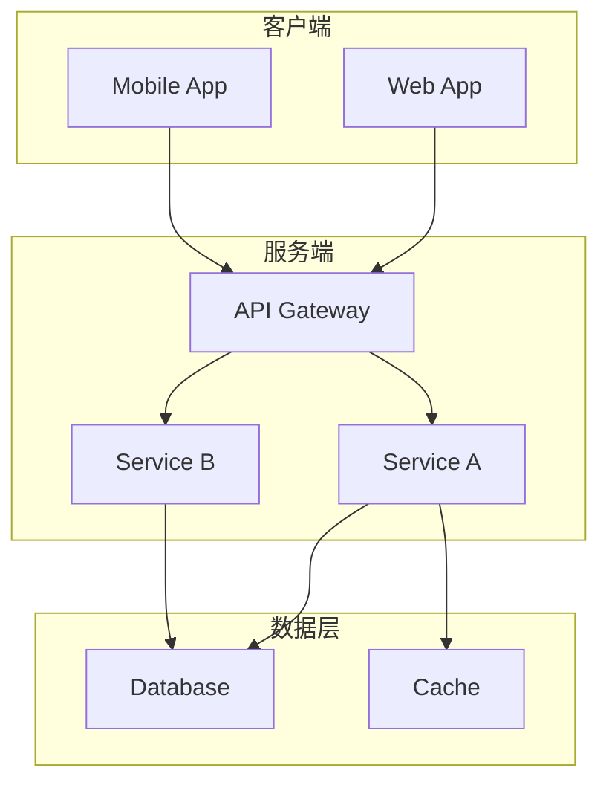

### 命名规则

- 节点使用组件名称，避免引号
- 使用 subgraph 组织相关组件
- 箭头方向：调用/依赖方向

### 分层架构模板

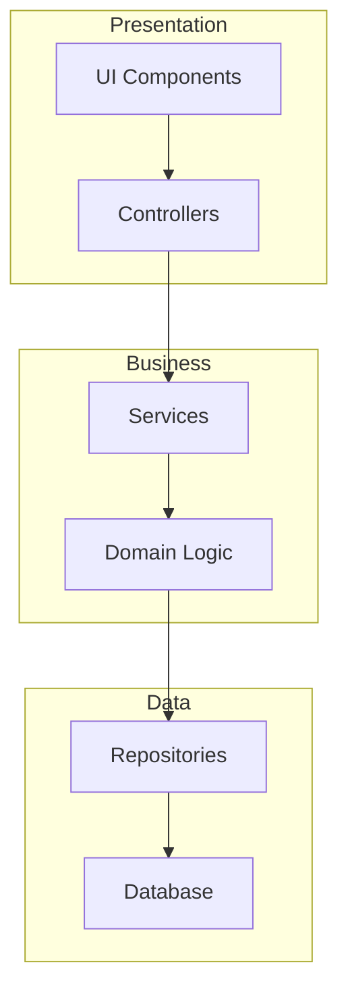

## 模块依赖图 (graph LR)

### 基本模板

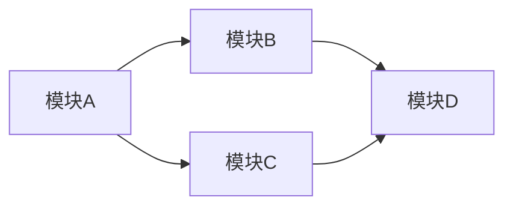

### 依赖类型

- `-->`：直接依赖
- `-.->`：间接依赖
- `==>`：强依赖

### Monorepo 模板

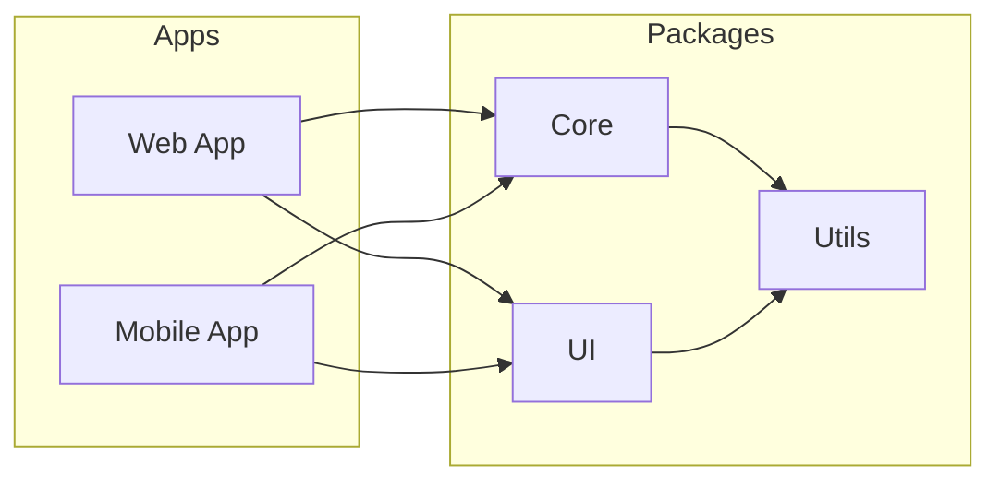

## 数据流图 (sequenceDiagram)

### 基本模板

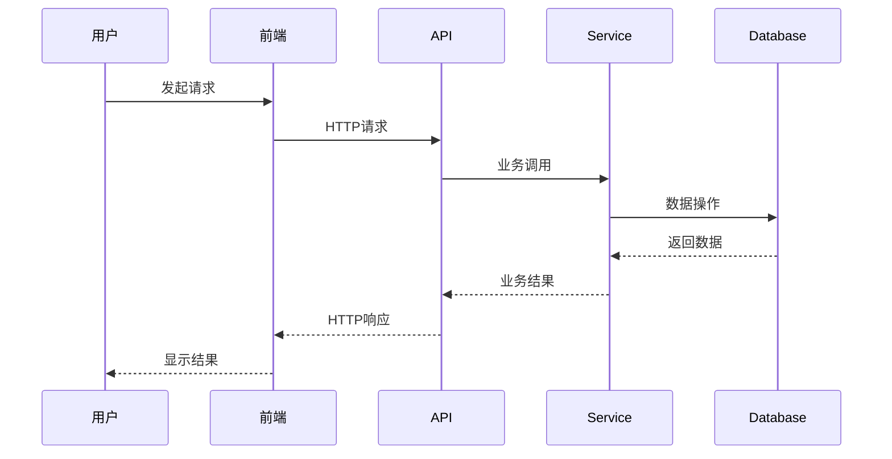

### 常用语法

- `->>`：同步请求
- `-->>`：异步响应
- `->>+`：激活
- `-->>-`：deactivate
- `--x`：失败

### 认证流程模板

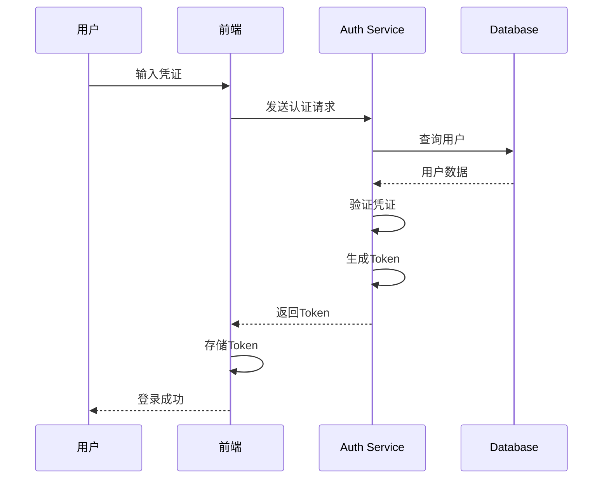

## 类图 (classDiagram)

### 基本模板

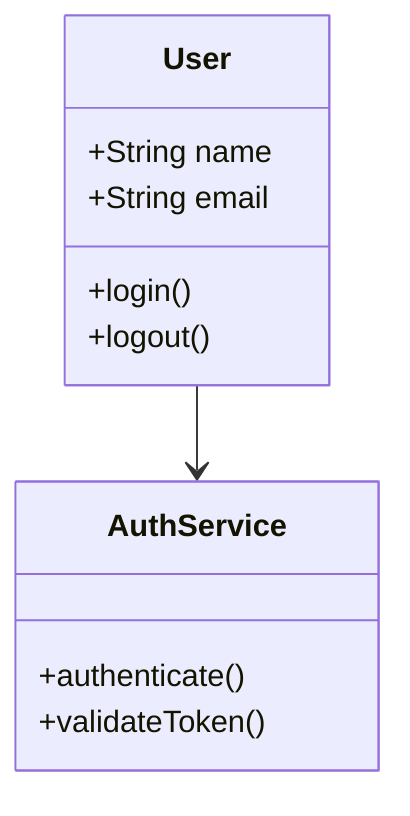

### 关系类型

- `-->`：关联
- `-->`：继承
- `--*`：组合
- `--o`：聚合
- `--|>`：实现

### DDD 模板

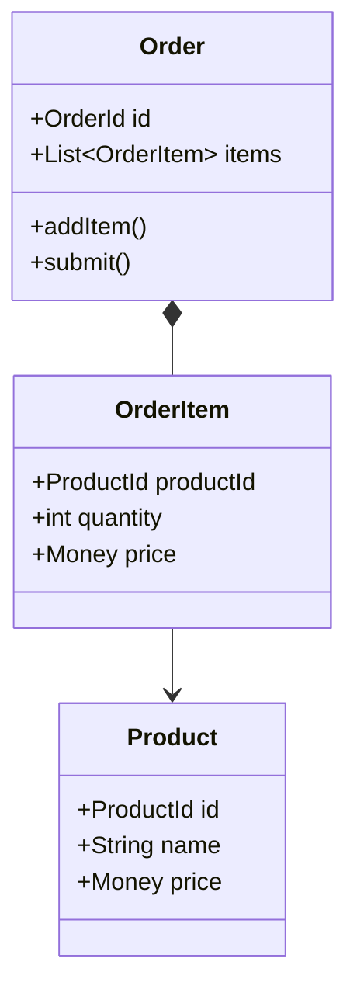

## 状态图 (stateDiagram-v2)

### 基本模板

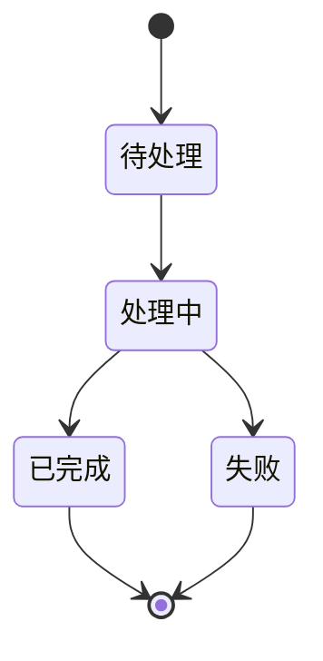

### 订单状态模板

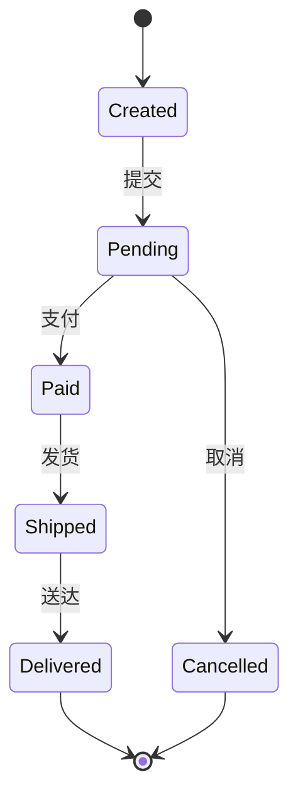

## 流程图 (flowchart)

### 基本模板

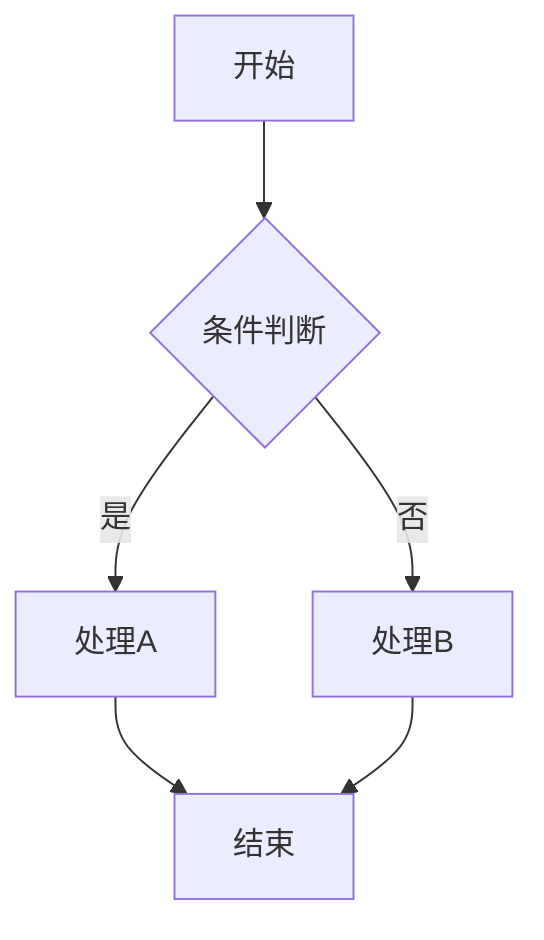

### 决策流程模板

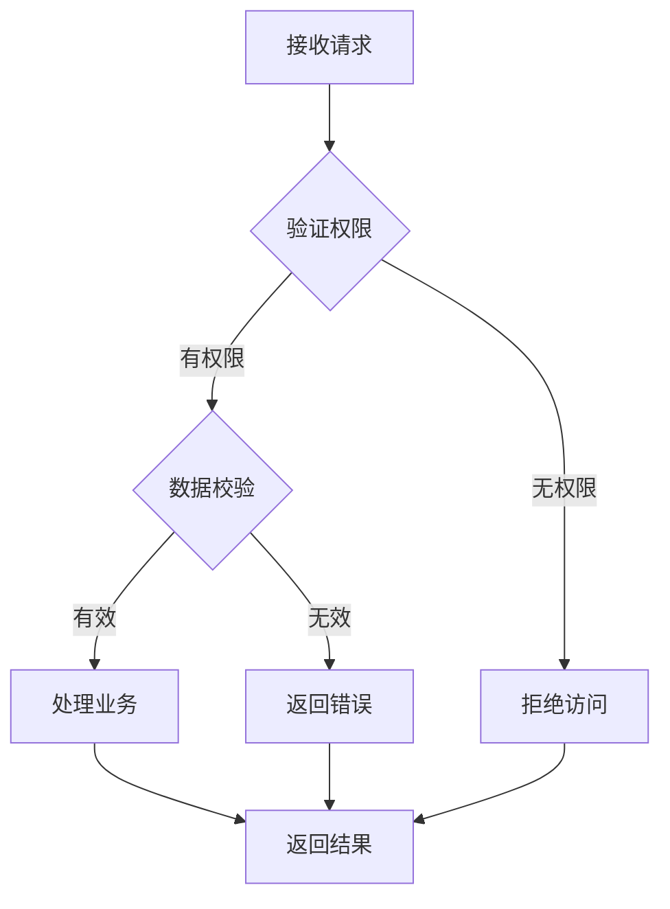

## 图表最佳实践

1. **简洁**：避免过多节点，保持可读性
2. **命名**：使用清晰的中文名称
3. **分组**：使用 subgraph 组织相关内容
4. **方向**：从上到下或从左到右
5. **注释**：在图表外添加说明文字
6. **一致性**：同一项目中图表风格保持一致

## 图表选择指南

| 分析内容 | 推荐图表类型 |
|---------|-------------|
| 系统整体结构 | graph TB |
| 模块依赖关系 | graph LR |
| 数据流转过程 | sequenceDiagram |
| 类/对象关系 | classDiagram |
| 状态变化 | stateDiagram-v2 |
| 业务流程 | flowchart |