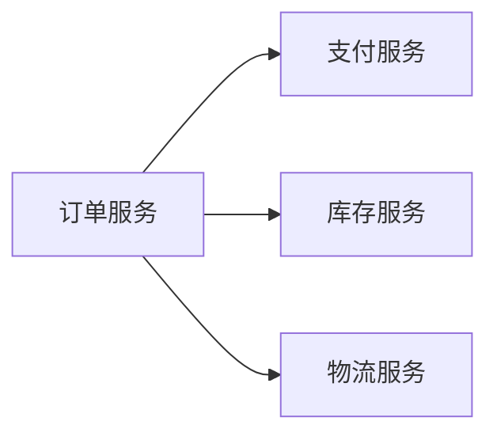
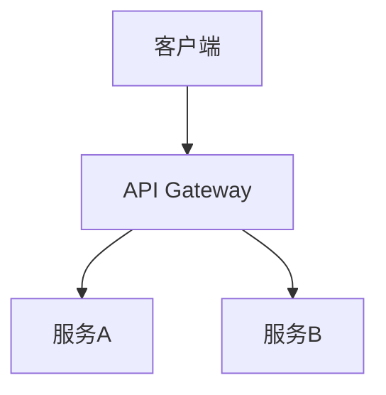

# 技术博客模板

## 文件结构

```markdown
# [标题]

> 发布日期：YYYY-MM-DD

## 背景

[问题来源和重要性]

## 问题分析

### 技术难点

[难点详细描述]

### 相关架构

```mermaid
[图表代码]
```

## 解决方案

### 核心思路

[方案概述]

### 实现细节

[详细实现步骤]

```[language]
[代码示例]
```

## 效果与总结

[解决效果和经验总结]

---

**相关文件**：
- [PLAN.md](../PLAN.md)
- [架构图](../analysis/diagrams/xxx.md)
```

## 各部分详细说明

### 标题

**要求**：
- 吸引人且准确描述内容
- 使用动词或疑问句
- 避免过于技术化或过于通俗

**示例**：
- ✅ 深入理解分布式事务的 Saga 模式实现
- ✅ 如何优雅地处理微服务间的数据一致性
- ❌ 分布式事务研究
- ❌ Saga 模式代码分析

### 背景

**要求**：
- 简明扼要说明问题来源
- 解释为什么这个问题重要
- 不超过200字

**示例**：
```markdown
## 背景

在微服务架构中，跨服务的数据一致性是一个经典难题。传统的分布式事务方案（如两阶段提交）在微服务场景下存在性能瓶颈和可用性问题。本文将介绍我们项目中采用的 Saga 模式解决方案。
```

### 问题分析

**要求**：
- 技术描述准确
- 引用相关架构图
- 说明问题的复杂性

**示例**：
```markdown
## 问题分析

### 技术难点

订单服务需要协调支付、库存、物流等多个服务完成一个完整的订单流程。每个服务都有独立的数据库，如何保证这些服务的数据一致性是核心难点。

### 相关架构


```

### 解决方案

**要求**：
- 思路清晰，步骤明确
- 代码示例有注释
- 突出关键部分

**示例**：
```markdown
## 解决方案

### 核心思路

采用 Saga 模式，将分布式事务拆分为一系列本地事务，每个本地事务都有对应的补偿操作。

### 实现细节

1. 定义 Saga 步骤
2. 执行正向流程
3. 失败时执行补偿流程

```python
# Saga 步骤定义
class OrderSaga:
    steps = [
        ('create_order', 'cancel_order'),
        ('reserve_inventory', 'release_inventory'),
        ('process_payment', 'refund_payment'),
    ]
    
    def execute(self):
        completed = []
        for action, compensation in self.steps:
            try:
                action()
                completed.append(compensation)
            except Exception:
                # 执行补偿
                for comp in reversed(completed):
                    comp()
                raise
```
```

### 效果与总结

**要求**：
- 说明解决效果
- 总结经验教训
- 给出建议或展望
- 不超过300字

**示例**：
```markdown
## 效果与总结

采用 Saga 模式后，系统在保证数据一致性的同时，性能提升了 30%，可用性也得到了显著改善。

主要经验：
1. 补偿操作要简单可靠
2. 需要完善的监控和日志
3. 考虑幂等性设计

---

**相关文件**：
- [PLAN.md](../PLAN.md) - 项目完整分析报告
- [架构图](../analysis/diagrams/system-architecture.md)
```

## 写作要点

### 1. 标题

- 使用动词或疑问句
- 例：深入理解 X、如何解决 Y 问题、X 最佳实践

### 2. 开头

- 简明扼要说明背景
- 不超过200字
- 引出核心问题

### 3. 正文

- 技术描述准确
- 使用图表辅助说明
- 代码示例有注释
- 分段清晰

### 4. 结尾

- 总结要点
- 给出建议或展望
- 不超过300字

## 图表使用

### 要求

- 每篇博客至少1个图表
- 图表前有说明文字
- 图表代码正确嵌入
- 图表简洁清晰

### 嵌入方式

```markdown
### 相关架构

以下是系统的整体架构图：


```

## 代码示例

### 要求

- 从实际代码提取
- 添加必要注释
- 突出关键部分
- 不超过30行

### 格式

```markdown
```python
# 关键代码示例
def process_order(order):
    # 1. 验证订单
    validate(order)
    
    # 2. 处理支付
    payment = process_payment(order)
    
    # 3. 更新库存
    update_inventory(order.items)
    
    return payment
```
```

## 字数要求

| 类型 | 字数 |
|------|------|
| 最少 | 2000字 |
| 推荐 | 3000-4000字 |
| 最多 | 5000字 |

## 禁止事项

- 模糊表述（如"某种方式"）
- 过度简化（如"很简单"）
- 无依据结论
- 过长代码块（超过30行）
- 无说明的图表
- 无注释的代码