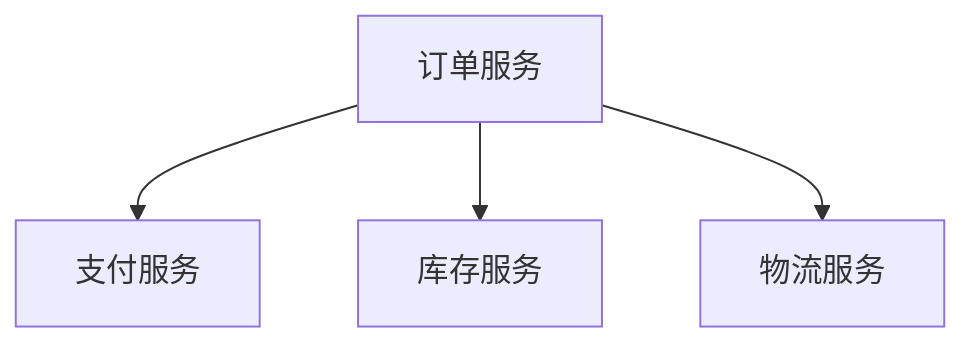
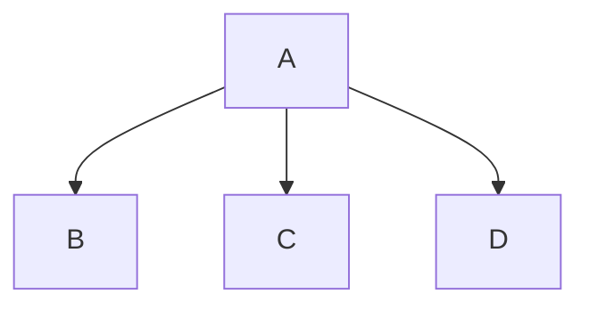

# 技术博客写作风格指南

## 语言风格

### 基本原则

- 使用简体中文
- 技术术语保留英文或使用通用译名
- 避免口语化表达
- 保持专业但易懂

### 技术术语处理

| 类型 | 处理方式 | 示例 |
|------|---------|------|
| 通用术语 | 保留英文 | API、SDK、HTTP、JSON |
| 有译名术语 | 使用译名 | 微服务、分布式、缓存 |
| 新术语 | 英文+解释 | Saga（分布式事务模式） |
| 代码相关 | 保留英文 | function、class、module |

### 语言风格示例

**好的示例**：
```markdown
在微服务架构中，服务间的数据一致性是一个核心挑战。Saga 模式通过将分布式事务拆分为一系列本地事务，每个事务都有对应的补偿操作，从而实现最终一致性。
```

**不好的示例**：
```markdown
微服务里面数据一致性挺难的。Saga 模式就是把大事务拆成小事务，每个小事务都有个回滚操作，这样就能保证数据最终是一致的。
```

## 结构要求

### 标题

**要求**：
- 使用动词或疑问句
- 吸引人且准确
- 避免过于技术化或过于通俗

**好的标题示例**：
- 深入理解分布式事务的 Saga 模式实现
- 如何优雅地处理微服务间的数据一致性
- 高并发场景下的缓存策略最佳实践
- 从零开始：构建可靠的异步任务处理系统

**不好的标题示例**：
- 分布式事务研究（过于模糊）
- Saga 模式代码分析（过于技术化）
- 我的缓存优化经验（过于个人化）

### 开头

**要求**：
- 简明扼要说明背景
- 不超过200字
- 引出核心问题

**好的开头示例**：
```markdown
## 背景

在电商系统中，订单创建涉及多个服务：订单服务、支付服务、库存服务、物流服务。这些服务各自维护独立的数据库，如何保证跨服务的数据一致性是一个经典难题。本文将介绍我们项目中采用的 Saga 模式解决方案。
```

### 正文

**要求**：
- 技术描述准确
- 使用图表辅助说明
- 代码示例有注释
- 分段清晰

**段落结构**：
```markdown
### [小节标题]

[说明文字]

[图表或代码]

[解释说明]
```

### 结尾

**要求**：
- 总结要点
- 给出建议或展望
- 不超过300字

**好的结尾示例**：
```markdown
## 效果与总结

采用 Saga 模式后，系统在保证数据一致性的同时，性能提升了 30%，可用性也得到了显著改善。

主要经验：
1. 补偿操作要简单可靠，避免补偿失败
2. 需要完善的监控和日志，便于问题排查
3. 考虑幂等性设计，防止重复执行

未来计划引入事件溯源（Event Sourcing）模式，进一步优化数据一致性保障机制。
```

## 图表使用

### 基本要求

- 每篇博客至少1个图表
- 图表前有说明文字
- 图表代码正确嵌入
- 图表简洁清晰

### 图表类型选择

| 内容类型 | 推荐图表 |
|---------|---------|
| 系统架构 | graph TB |
| 模块关系 | graph LR |
| 数据流程 | sequenceDiagram |
| 类关系 | classDiagram |
| 状态变化 | stateDiagram-v2 |
| 业务流程 | flowchart |

### 图表嵌入方式

**好的示例**：
```markdown
### 系统架构

以下是订单系统的整体架构，展示了各服务间的调用关系：



架构说明：
- 订单服务作为协调者，负责发起和协调各服务
- 各服务独立部署，拥有独立的数据库
```

**不好的示例**：
```markdown
### 系统架构


```

（缺少说明文字，节点命名不清晰）

## 代码示例

### 基本要求

- 从实际代码提取
- 添加必要注释
- 突出关键部分
- 不超过30行

### 代码格式

**好的示例**：
```markdown
```python
# Saga 步骤定义
class OrderSaga:
    # 定义正向操作和对应的补偿操作
    steps = [
        ('create_order', 'cancel_order'),
        ('reserve_inventory', 'release_inventory'),
        ('process_payment', 'refund_payment'),
    ]
    
    def execute(self):
        """执行 Saga 流程"""
        completed = []
        for action, compensation in self.steps:
            try:
                action()  # 执行正向操作
                completed.append(compensation)
            except Exception:
                # 失败时执行补偿
                for comp in reversed(completed):
                    comp()
                raise
```
```

**不好的示例**：
```markdown
```python
class OrderSaga:
    steps = [
        ('create_order', 'cancel_order'),
        ('reserve_inventory', 'release_inventory'),
        ('process_payment', 'refund_payment'),
    ]
    
    def execute(self):
        completed = []
        for action, compensation in self.steps:
            try:
                action()
                completed.append(compensation)
            except Exception:
                for comp in reversed(completed):
                    comp()
                raise
```
```

（缺少注释，难以理解）

## 禁止事项

### 模糊表述

**禁止**：
- "某种方式"
- "一些处理"
- "相关内容"
- "适当的配置"

**应该**：
- 明确说明具体方式
- 列出具体内容
- 给出具体配置

### 过度简化

**禁止**：
- "很简单"
- "很容易"
- "只需要几步"
- "没什么难度"

**应该**：
- 说明具体步骤
- 解释可能遇到的问题
- 给出注意事项

### 无依据结论

**禁止**：
- "性能提升了很多"
- "效果很好"
- "解决了问题"

**应该**：
- 给出具体数据（如"性能提升了 30%"）
- 说明验证方式
- 提供测试结果

### 过长代码块

**禁止**：
- 超过30行的代码
- 完整的文件内容
- 大量重复代码

**应该**：
- 提取关键部分
- 添加注释说明
- 突出核心逻辑

## 写作流程

### 1. 确定主题

- 从 difficulties.json 选择高潜力主题
- 确定目标读者
- 明确要解决的问题

### 2. 收集素材

- 读取 PLAN.md 获取背景信息
- 读取相关图表文件
- 提取关键代码片段

### 3. 生成大纲

- 背景：问题来源和重要性
- 问题分析：技术难点描述
- 解决方案：核心思路和实现
- 总结：效果和经验

### 4. 撰写内容

- 按大纲逐节撰写
- 嵌入图表和代码
- 保持语言风格一致

### 5. 自我审查

- 检查结构完整性
- 检查技术准确性
- 检查图表正确性
- 检查语言流畅性

## 常见问题

### Q: 技术术语应该用英文还是中文？

A: 通用术语保留英文（如 API、SDK），有通用译名的使用译名（如微服务、分布式），新术语或特殊术语用英文加解释。

### Q: 代码示例应该多长？

A: 不超过30行，提取关键部分，添加必要注释。

### Q: 图表应该多复杂？

A: 保持简洁，节点不超过10个，突出核心关系。

### Q: 字数应该控制在什么范围？

A: 2000-5000字，推荐3000-4000字。