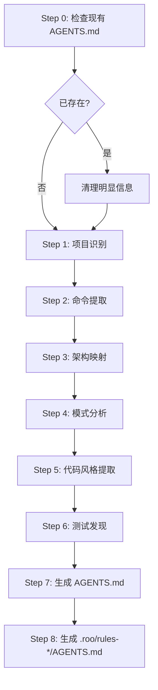
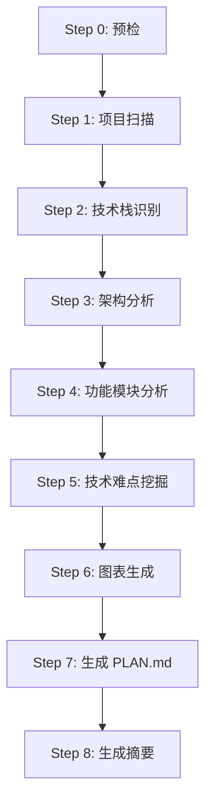
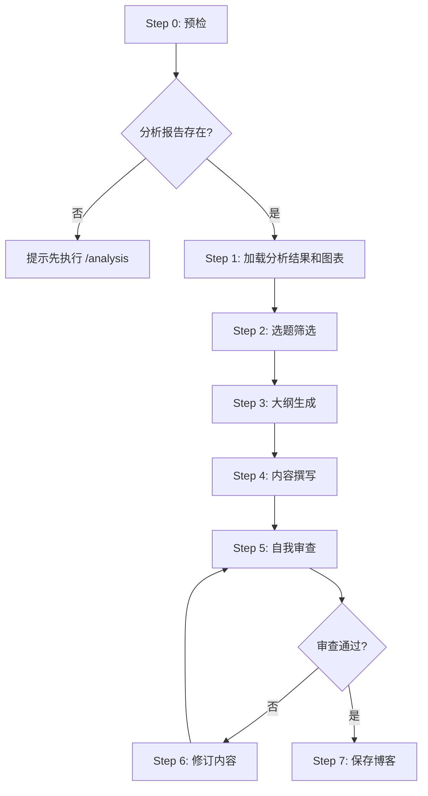

# Arch Analyzer 命令详解

## 命令概览

| 命令 | 功能 | 输出 |
|------|------|------|
| `/init` | 生成 AGENTS.md | `AGENTS.md`、`.roo/rules-*/AGENTS.md` |
| `/analysis` | 深度分析项目 | `PLAN.md`、`analysis/` 目录 |
| `/blog` | 生成技术博客 | `blogs/YYYY-MM-DD-topic.md` |

---

## /init

### 功能说明

分析代码库并生成 AGENTS.md 文件，让 AI 助手能立即高效地工作。

### 核心理念

**只记录非显而易见的项目特定信息**，排除所有标准实践和框架默认值。

### 使用场景

- 新项目首次配置
- 项目结构变更后更新
- 团队协作规范化

### 执行流程



### 详细步骤

| Step | 名称 | 说明 |
|------|------|------|
| 0 | 检查现有文件 | 检查 AGENTS.md、CLAUDE.md、.cursorrules 等现有规则文件 |
| 1 | 项目识别 | 识别语言、框架、构建系统、包管理器 |
| 2 | 命令提取 | 提取构建、测试、lint、运行命令（仅非标准的） |
| 3 | 架构映射 | 识别核心组件、入口点、数据流 |
| 4 | 模式分析 | 发现项目特有的工具函数、非标准模式、自定义约定 |
| 5 | 代码风格 | 从配置文件提取格式化、命名约定 |
| 6 | 测试发现 | 测试框架、运行方式、目录要求 |
| 7 | 生成主文件 | 生成精简的 AGENTS.md（约20行） |
| 8 | 生成模式文件 | 生成 .roo/rules-*/ 下的 AGENTS.md |

### 输出产物

```text
project-root/
├── AGENTS.md                          # 主引导文件（约20行）
└── .roo/
    ├── rules-code/AGENTS.md           # 编码模式特定规则
    ├── rules-debug/AGENTS.md          # 调试模式特定规则
    ├── rules-ask/AGENTS.md            # 问答模式特定规则
    └── rules-architect/AGENTS.md      # 架构模式特定规则
```

### AGENTS.md 示例

```markdown
# AGENTS.md

This file provides guidance to agents when working with code in this repository.

## Build Commands
- Run tests from `packages/core/` directory, not root (vitest config location)
- `npm run dev:all` starts all services (not just `npm run dev`)

## Code Style
- Use `safeWriteJson()` from `src/utils/file.ts` for JSON writes (prevents corruption)
- API calls must use retry wrapper in `src/api/utils/retry.ts`

## Architecture
- `src/` is VSCode extension, not web app source (counterintuitive)
- Webview and extension communicate via IPC in `packages/ipc/src/`
```

### 质量标准

- 每一行都必须是"非显而易见"的信息
- 排除所有标准实践、框架默认值、常见模式
- 文件应该尽可能短，但包含足够的项目特定知识
- 更新现有文件时，文件应该变短而非变长

---

## /analysis

### 功能说明

深度分析项目代码，生成技术分析文档 PLAN.md 和 Mermaid 架构图。

### 使用场景

- 项目架构理解
- 技术难点发现
- 为博客写作准备素材

### 前置条件

- 项目目录可读
- 有基本的源代码文件

### 执行流程



### 详细步骤

| Step | 名称 | 输入 | 输出 | 说明 |
|------|------|------|------|------|
| 0 | 预检 | 项目路径 | 校验结果 | 确认项目可读、目录结构 |
| 1 | 项目扫描 | 项目根目录 | 文件清单 | 扫描项目文件，识别主要目录结构 |
| 2 | 技术栈识别 | 文件清单 | 技术栈报告 | 识别编程语言、框架、依赖 |
| 3 | 架构分析 | 源代码 | 架构描述 | 分析项目架构模式、模块划分 |
| 4 | 功能模块分析 | 源代码 | 功能清单 | 分析各模块功能职责 |
| 5 | 技术难点挖掘 | 源代码+分析结果 | 难点清单 | 发掘技术难点、亮点 |
| 6 | 图表生成 | 分析结果 | Mermaid 图表 | 生成架构图、依赖图、数据流图 |
| 7 | 生成报告 | 所有分析结果 | 分析报告 | 汇总生成结构化报告 |

### 输出产物

```text
analysis/
├── .analysis-state.json       # 分析状态文件
├── tech-stack.json            # 技术栈信息
├── architecture.md            # 架构分析报告（内含 Mermaid 图表）
├── diagrams/                  # 独立图表文件
│   ├── system-architecture.md # 系统架构图
│   ├── module-dependency.md   # 模块依赖图
│   ├── data-flow.md           # 数据流图
│   └── class-diagram.md       # 类图（可选）
├── modules.md                 # 功能模块分析
├── difficulties.json          # 技术难点清单
└── summary.md                 # 分析摘要
```

### 图表类型

| 图表类型 | Mermaid 语法 | 说明 |
|---------|-------------|------|
| 系统架构图 | graph TB | 展示系统整体架构和模块关系 |
| 模块依赖图 | graph LR | 展示模块间依赖关系 |
| 数据流图 | sequenceDiagram | 展示核心数据流转 |
| 类图 | classDiagram | 展示核心类关系（面向对象项目） |
| 状态图 | stateDiagram-v2 | 展示状态机（如有） |

### tech-stack.json 示例

```json
{
  "languages": ["Python", "TypeScript"],
  "frameworks": ["FastAPI", "React"],
  "build_tools": ["npm", "pip"],
  "dependencies": {
    "production": [...],
    "development": [...]
  },
  "code_metrics": {
    "total_files": 150,
    "total_lines": 25000,
    "by_language": {...}
  }
}
```

### difficulties.json 示例

```json
{
  "difficulties": [
    {
      "id": "diff-001",
      "title": "分布式事务处理",
      "description": "使用 Saga 模式处理跨服务事务",
      "location": "src/services/order.py",
      "difficulty_level": "high",
      "blog_potential": "high",
      "tags": ["distributed", "transaction", "saga"]
    }
  ],
  "highlights": [...],
  "potential_issues": [...]
}
```

### 质量标准

- PLAN.md 结构完整
- 至少生成3个 Mermaid 图表
- 技术栈识别准确
- 技术难点有具体代码位置
- 图表可正确渲染
- 分析结果可被 `/blog` 直接消费

---

## /blog

### 功能说明

基于分析结果生成可发布的技术博客，自动引用 Mermaid 图表。

### 使用场景

- 技术博客写作
- 项目文档生成
- 技术分享准备

### 前置条件

必须先执行 `/analysis`，检查以下文件存在：
- `PLAN.md`
- `analysis/difficulties.json`
- `analysis/diagrams/`

### 执行流程



### 详细步骤

| Step | 名称 | 输入 | 输出 | 说明 |
|------|------|------|------|------|
| 0 | 预检 | 项目路径 | 校验结果 | 确认分析报告存在 |
| 1 | 加载分析结果 | analysis/ | 分析数据+图表 | 读取所有分析产物和 Mermaid 图表 |
| 2 | 选题筛选 | difficulties.json | 选题列表 | 筛选适合博客的难点选题 |
| 3 | 大纲生成 | 选题 | 博客大纲 | 生成博客结构大纲 |
| 4 | 内容撰写 | 大纲+图表 | 博客草稿 | 撰写完整博客，引用 Mermaid 图表 |
| 5 | 自我审查 | 博客草稿 | 审查报告 | 检查内容质量、结构、图表引用 |
| 6 | 修订内容 | 审查报告 | 修订后博客 | 根据审查意见修订 |
| 7 | 保存博客 | 最终博客 | 博客文件 | 保存到 blogs/ 目录 |

### 输出产物

```text
blogs/
├── .blog-state.json            # 博客状态文件
├── YYYY-MM-DD-topic-slug.md    # 博客文章（按日期命名）
└── drafts/                     # 草稿目录
    └── topic-draft.md
```

### 博客结构

```markdown
# [标题]

> 发布日期：YYYY-MM-DD

## 背景

[问题描述]

## 问题分析

### 技术难点

[难点描述]

### 相关架构

```mermaid
[Mermaid 图表代码]
```

## 解决方案

### 核心思路

[方案概述]

### 实现细节

[详细实现]

```[language]
[代码示例]
```

## 效果与总结

[总结内容]

---

**相关文件**：
- [PLAN.md](../PLAN.md) - 项目完整分析报告
- [架构图](../analysis/diagrams/system-architecture.md)
```

### 审查清单

- [ ] 标题是否吸引人且准确
- [ ] 技术难点描述是否清晰
- [ ] Mermaid 图表是否正确嵌入
- [ ] 代码示例是否准确
- [ ] 文章结构是否完整
- [ ] 语言是否流畅、专业
- [ ] 字数是否在合理范围（2000-5000字）

### 评分标准

| 维度 | 权重 | 评分标准 |
|------|------|---------|
| 结构完整性 | 20% | 四部分完整 |
| 技术准确性 | 30% | 描述准确无误 |
| 图表质量 | 20% | 正确嵌入且清晰 |
| 代码示例 | 15% | 准确且有注释 |
| 语言流畅性 | 15% | 专业且易读 |

- **总分 >= 85**：通过
- **总分 70-85**：建议修订
- **总分 < 70**：必须修订

### 质量标准

- 博客结构完整
- 至少引用1个 Mermaid 图表
- 审查评分 >= 85
- 字数在 2000-5000 范围
- 文件命名规范

---

## 命令组合使用

### 典型工作流

```bash
# 1. 首次使用，初始化项目
/init

# 2. 深度分析项目
/analysis

# 3. 生成技术博客
/blog
```

### 数据依赖

```mermaid
graph LR
    INIT[/init] -->|AGENTS.md| ANALYSIS[/analysis]
    ANALYSIS -->|analysis/ 目录| BLOG[/blog]
    ANALYSIS -->|diagrams/ 图表| BLOG
    
    style INIT fill:#4CAF50,color:#fff
    style ANALYSIS fill:#2196F3,color:#fff
    style BLOG fill:#FF9800,color:#fff
```

**关键约束**：
- `/blog` 依赖 `/analysis` 的输出，必须先执行 `/analysis`
- `/init` 是可选的，但建议在首次使用时执行
- `/analysis` 生成的图表可以被 `/blog` 直接引用